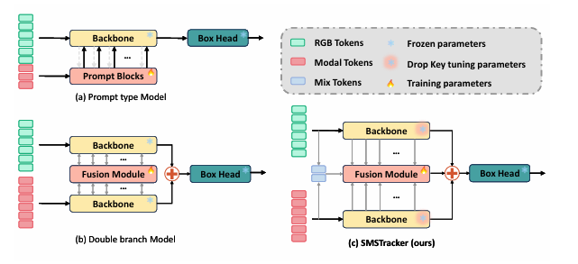
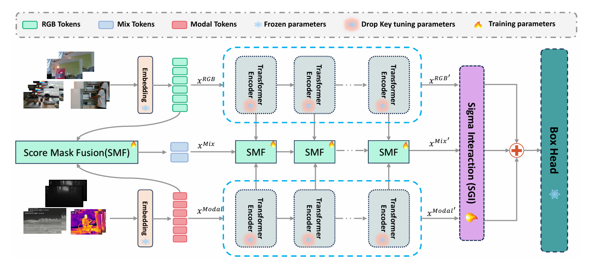
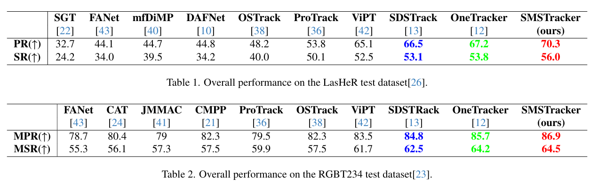
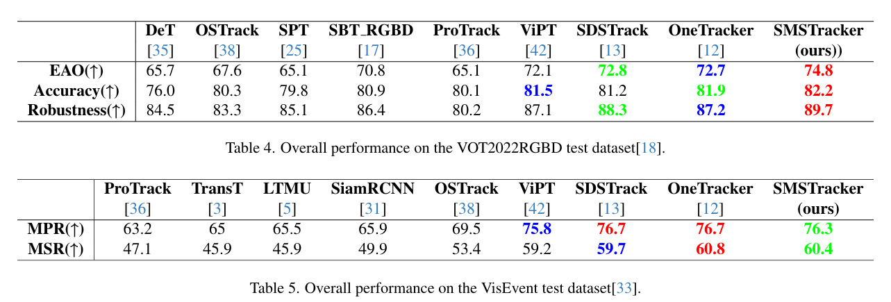
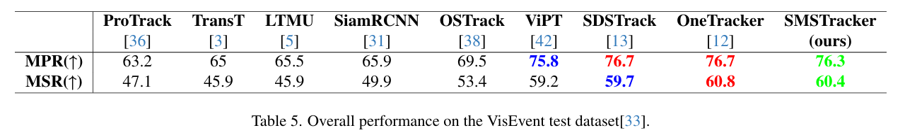

# SMSTracker: Tri-path Score Mask Sigma Fusion for Multi-Modal Tracking [iccv2025]

Official implementation of SMSTracker, including models and training&testing codes.

[Models & Raw Results](https://drive.google.com/drive/folders/1RhhVT7Cs3jUSYCnyR-eohjEju6gP3eHI?usp=sharing)(Google Drive)



# Introduction

- Wepropose anovel **tri-path** scoremask sigma fusion framework for multi-modal tracking, SMSTracker. It aims to effectively extract and fuse RGB
  with other modal features under complex conditions, providing a reliable foundation for tracking applications.
- We design the SMF module to evaluate the reliability of features from each modality, which enables optimal exploitation of complementary features
  between modalities.
- We propose the SGI module to optimize feature interaction and fusion for facilitating feature sharing and refinement across the tri-path branches,
  thereby enhancing cross-feature integration.
- We introduce the DKF strategy to fine-tune the model, prevent overfitting from excessive information, address unequal data contribution, and improve
  the model's understanding of modal information.



# Results

## On RGBT Dataset



## On RGBD Dataset



## On RGBE Dataset



# Usage

## Installation

Create and activate a conda environment:

```bash
conda create -n SMSTracker python=3.8
conda activate SMSTracker
```

Install pytorch

```bash
conda install pytorch torchvision torchaudio cudatoolkit=11.8
```

Install Mamba

```bash
cd lib/models/layer/selective_scan && pip install . && cd ../../../..
```

## Data preparation

Download the datasets and put them in anywhere you like, then modify the dataset path in the config file.

    change the dataset.{LasHeR,VisEvent,DepthTrack}.{train,val,test}.path in './lib/config/*.yaml' to your dataset path.

change these point in `lib/config/*.yaml`

1. workspace.dir # **the path to save the model and log**
2. workspace.log_file # **spicify the log file name and path**
3. test.checkpoint # **the checkpoint file path use for testing**
4. analysis.* # **the path to save the analysis results (RGBT,RGBE)**


# Training
Dowmload the pretrained [foundation model](https://drive.google.com/drive/folders/1ttafo0O5S9DXK2PX0YqPvPrQ-HWJjhSy?usp=sharing) (OSTrack) and put it under ./pretrained/.
and change ./train/*.py change the line 64

```bash
cd ./scripts/* # choose a training script
bash train.sh
```

You can train models with various modalities and variants by modifying ./config/*.yaml 
and ./train/\*.py.

# Testing
## For RGB-D benchmarks
[DepthTrack Test set & VOT22_RGBD]\
These two benchmarks are evaluated using [VOT-toolkit](https://github.com/votchallenge/toolkit). \
You need to put the DepthTrack test set to```./Depthtrack_workspace/``` and name it 'sequences'.\
You need to download the corresponding test sequences at```./vot22_RGBD_workspace/```.

```
bash eval_rgbd.sh
```

## For RGB-T benchmarks
[LasHeR & RGBT234] \
Modify the <DATASET_PATH> and <SAVE_PATH> in```./RGBT_workspace/test_rgbt_mgpus.py```, then run:
```
bash eval_rgbt.sh
```
We refer you to [LasHeR Toolkit](https://github.com/BUGPLEASEOUT/LasHeR) for LasHeR evaluation, 
and refer you to [MPR_MSR_Evaluation](https://sites.google.com/view/ahutracking001/) for RGBT234 evaluation.


## For RGB-E benchmark
[VisEvent]\
Modify the <DATASET_PATH> and <SAVE_PATH> in```./RGBE_workspace/test_rgbe_mgpus.py```, then run:
```
bash eval_rgbe.sh
```
We refer you to [VisEvent_SOT_Benchmark](https://github.com/wangxiao5791509/VisEvent_SOT_Benchmark) for evaluation.


# Acknowledgment
- This repo is based on [OSTrack](https://github.com/botaoye/OSTrack) which is an excellent work.
- We thank for the [PyTracking](https://github.com/visionml/pytracking) library, which helps us to quickly implement our ideas.
- We Thank for the [ViPT](https://github.com/jiawen-zhu/ViPT/tree/main) and [Sigma](https://github.com/zifuwan/Sigma), which are excellent and inspiring works.